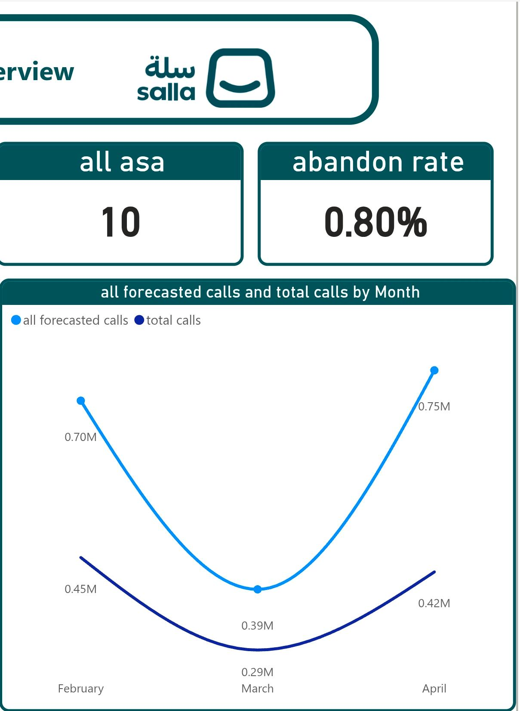
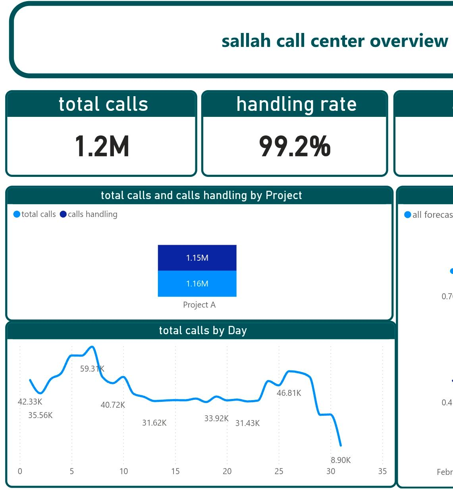

# Salla Call Center Performance Dashboard

This dashboard presents key call center performance metrics and operational insights for Salla.

## Key KPIs

- Total Calls: 1.7 Million
- Handling Rate: 98.7%
- Average Speed of Answer (ASA): 9 Seconds
- Abandon Rate: 1.32%
## Dashboard Preview

- Power BI
- Data Analysis
- KPI Reporting
- Business Intelligence
- Dashboard Design
